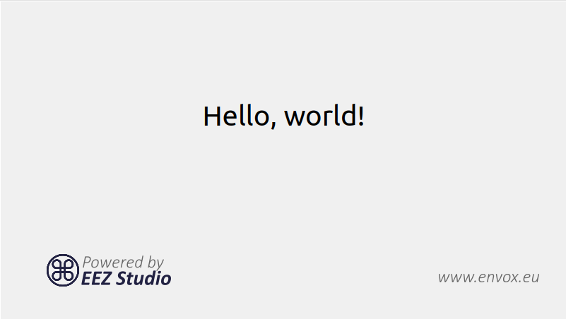

-   Edit `resources\manifest.json` where you can set your dashboard eez-project file
-   Change `icon.ico` and `icon.icns` files
-   Add IEXT files in `resources\extensions`
-   Set `background.png` for Mac DMG package

```
npm install
npm run build
npm run dist
```

### Build

-   Install `Node.JS 16.x` or newer

#### Only Linux:

```
sudo apt-get install build-essential libudev-dev libnss3
```

#### Only Raspbian:

Install Node.js 16 and npm on Raspberry Pi: https://lindevs.com/install-node-js-and-npm-on-raspberry-pi/

```
sudo apt-get install build-essential libudev-dev libopenjp2-tools ruby-full
sudo gem install fpm
```

#### All platforms:

```
git clone https://github.com/eez-open/studio
cd studio
npm install
npm run build
```

Start with:

```
npm start
```

Build distribution package:

```
npm run dist
```
