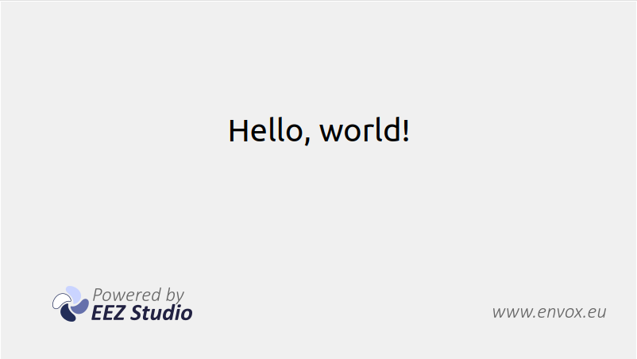

-   Edit `resources\manifest.json` where you can set your dashboard eez-project file
-   Change `icon.ico` and `icon.icns` files
-   Add IEXT files in `resources\extensions`
-   Set `background.png` for Mac DMG package

```
npm install
npm run build
npm run dist
```
